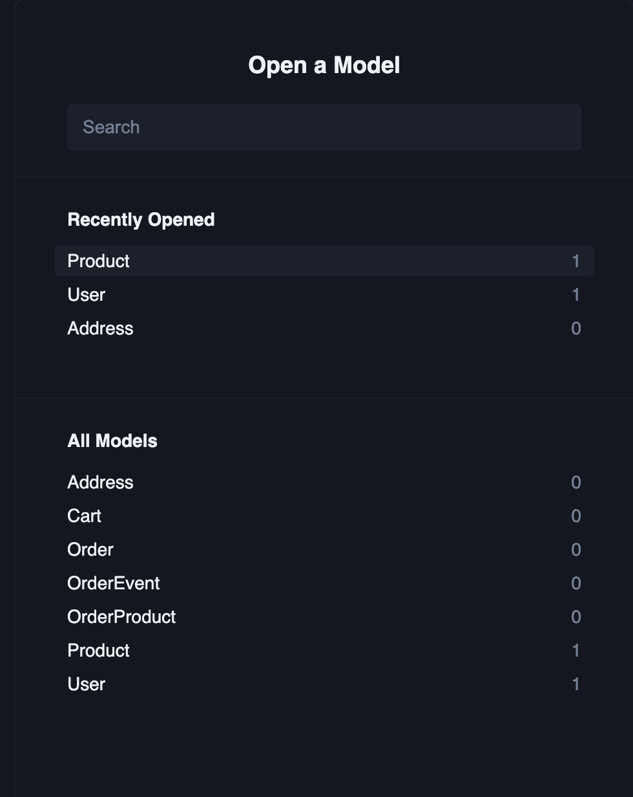

# Ecommerce-API-Node-Typescrip-Prisma-ORM



## Before Start Project :

1. must have .env file
   

2. connet db with prisma orm

- migration to create table : npx prisma migrate dev --name MIGRATIONNAME

3. start project : yarn start

## Prisma command :

- npx prisma studio
- npx prisma generate

## Here's the documentation link for the json file the import in postman:

```javascript
https://documenter.getpostman.com/view/18365558/2sA3JDiRA5
```
